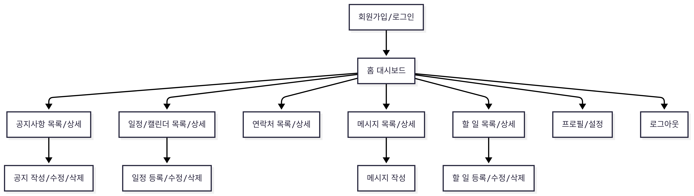
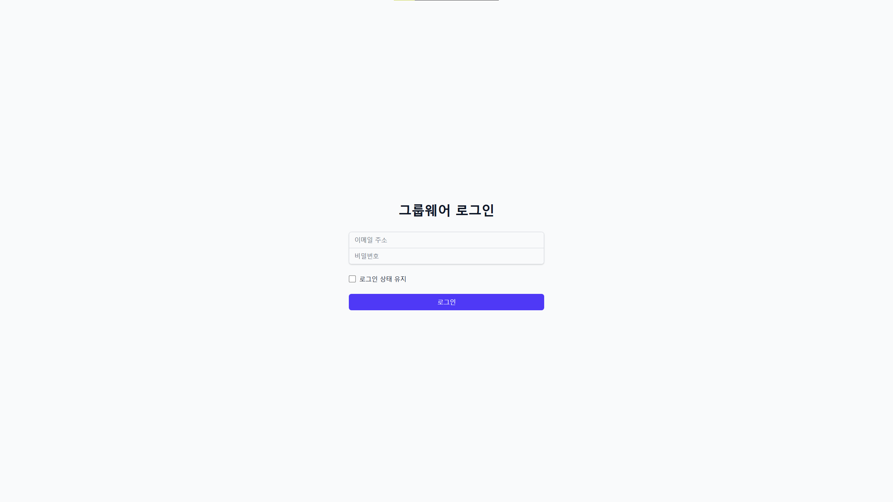
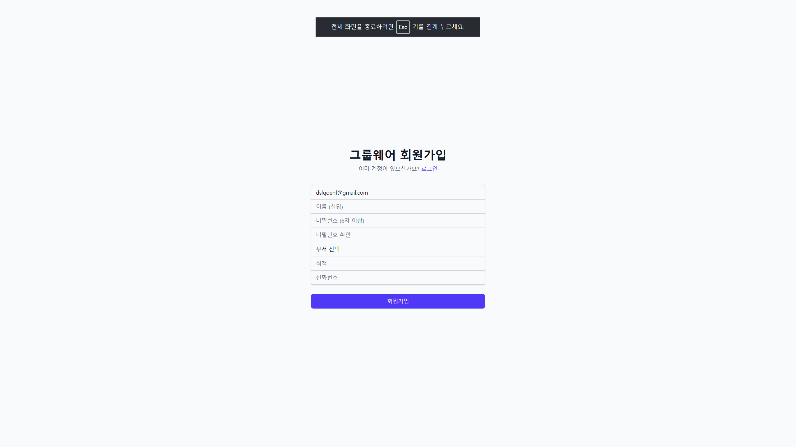
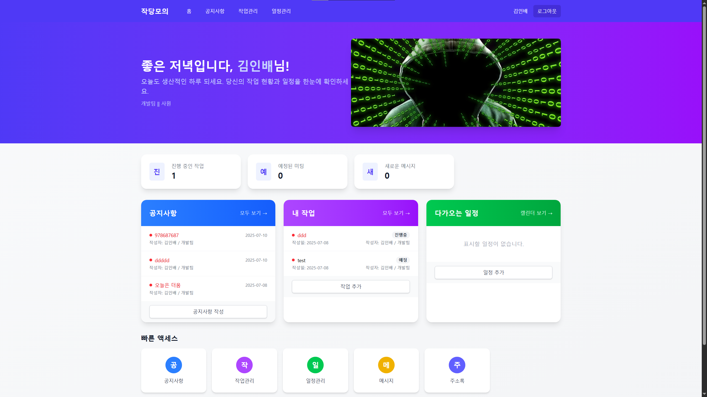
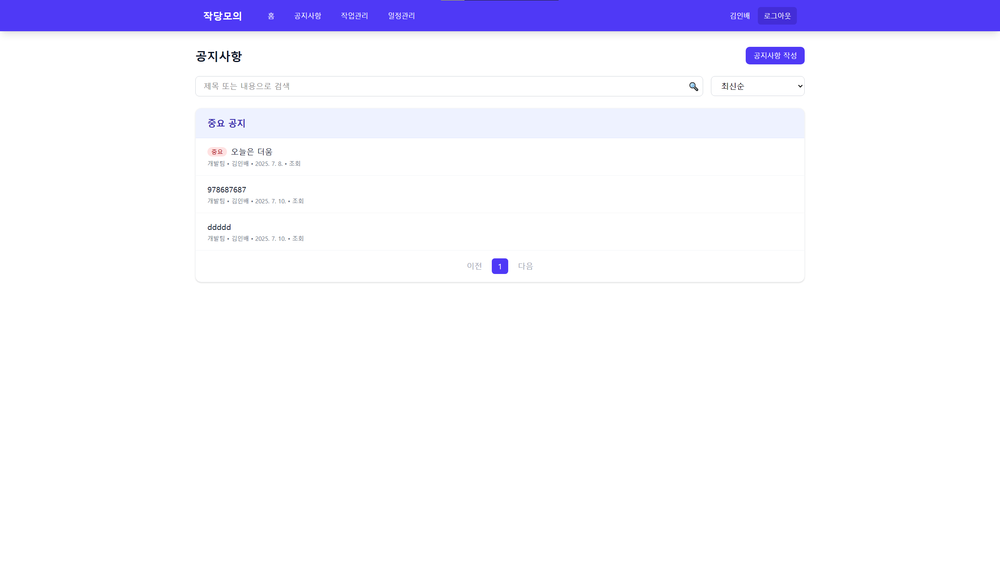
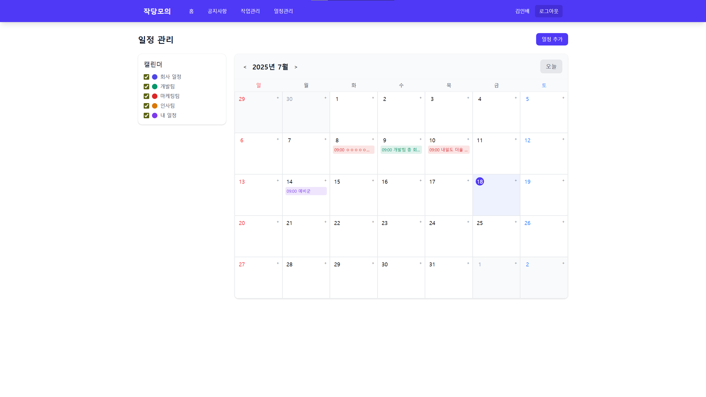
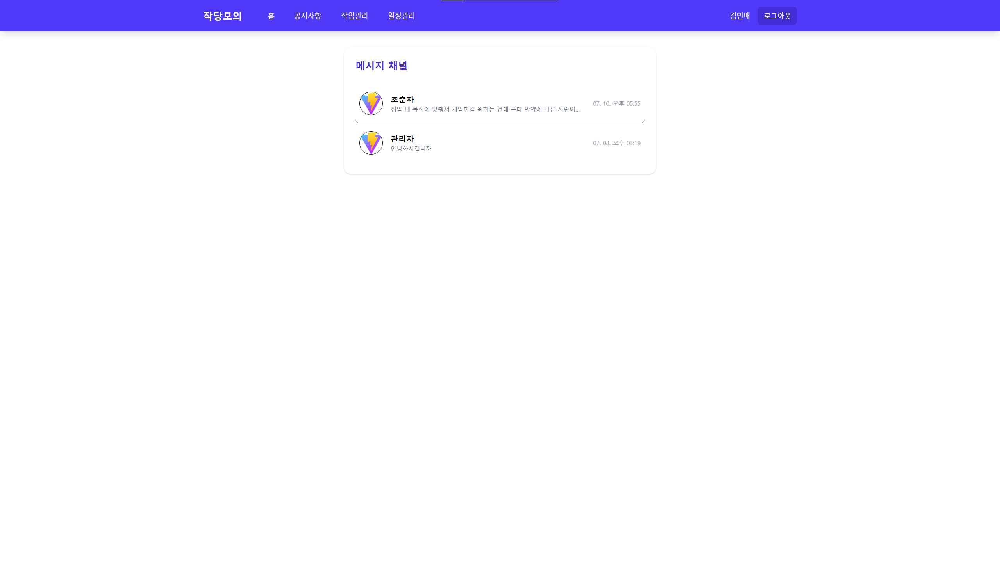

## 주요 기술 스택

- **React**: 리액트
- **Vite**: 빌드
- **Firebase**: 인증, Firestore DB,Realtime DB 호스팅 등
- **Zustand**: 상태 관리 라이브러리
- **Styled-components**: CSS-in-JS 스타일링
- **React Router v7**: 라우팅
- **Tailwind CSS**: 유틸리티 퍼스트 CSS 프레임워크
- **EmailJS**: 초대 메일 발송

---

## 폴더 구조

```
src/
  ├── App.jsx                # 라우팅 및 앱 진입점
  ├── main.jsx               # React DOM 렌더링
  ├── index.css              # 전역 스타일
  ├── firebase.js            # Firebase 초기화 및 내보내기
  ├── assets/                # 정적 리소스
  ├── components/            # 공통 UI 컴포넌트 및 위젯
  │   ├── AnnouncementsWidget.jsx
  │   ├── EventsWidget.jsx
  │   ├── TasksWidget.jsx
  │   ├── InviteUser.jsx
  │   ├── Navbar.jsx
  │   ├── Layout.jsx
  │   ├── UserMenu.jsx
  │   ├── PrivateRoute.jsx
  │   ├── dashboard/
  │   │   └── NoticeWidget.jsx
  │   └── calendar/
  │       └── CalendarCategories.jsx
  ├── context/
  │   └── AuthContext.jsx    # 인증 컨텍스트
  ├── former/                # 폼 및 인증 관련 컴포넌트
  │   ├── AddData.jsx
  │   ├── Home.jsx
  │   ├── Login.jsx
  │   └── useAuthState.jsx
  ├── pages/                 # 주요 페이지(라우트)
  │   ├── HomePage.jsx
  │   ├── NotFoundPage.jsx
  │   ├── MessageListPage.jsx
  │   ├── MessagePage.jsx
  │   ├── ProfilePage.jsx
  │   ├── auth/
  │   │   ├── AdminPage.jsx
  │   │   ├── AuthInit.jsx
  │   │   ├── LoginPage.jsx
  │   │   └── SignupPage.jsx
  │   ├── contacts/
  │   │   └── ContactsPage.jsx
  │   ├── tasks/
  │   │   ├── TasksPage.jsx
  │   │   ├── taskFormPage.jsx
  │   │   ├── TaskDetailPage.jsx
  │   │   └── TaskManagementPage.jsx
  │   ├── notice/
  │   │   ├── NoticeListPage.jsx
  │   │   ├── NoticeFormPage.jsx
  │   │   └── NoticeDetailpage.jsx
  │   └── calendar/
  │       ├── CalendarPage.jsx
  │       ├── DayViewPage.jsx
  │       ├── EventDetailPage.jsx
  │       └── EventFormPage.jsx
  └── store/                 # 전역 상태 관리(zustand)
  │   ├── authStore.jsx
  │   └── noticeStore.jsx
```

##[유저 플로우]


---

## 주요 화면

### 1. 로그인 페이지 및 회원가입 페이지




### 2. 메인 페이지



### 3. 공지사항 목록



### 4. 일정/캘린더



### 5. 할 일(Task) 관리


### 6. 메시지 페이지



---

## 주요 기능

- **회원가입/로그인/로그아웃** (Firebase Auth)
  -- \*\* email JS로 초대된 이메일로만 회원가입이 가능하도록 설계하였습니다.
- **공지사항 관리** (공지 작성, 수정, 삭제, 목록, 상세)
  -- \*\* 공지 작성시 작성자에 부서와 이름을 자동으로 기입되도록 하였습니다.
- **일정/캘린더 관리** (일정 등록, 수정, 삭제, 상세, 카테고리)
  -- \*\* 캘린더 일정 등록시 다가올 일정은 메인페이지 위젯에 나타나도록 하였습니다.
- **연락처 관리** (연락처 목록, 상세)
  -- \*\* 연락처 관리에서 전화번호 수정 및 메시지 채널을 만들도록 하였습니다.
- **메시지** (메시지 목록, 상세)
  -- \*\* Realtime DB를 이용하여 실시간으로 변동되는 DB 값을 가져오도록 하였습니다.
- **할 일(Task) 관리** (등록, 수정, 삭제, 상세, 관리)
  -- \*\* 진행중 , 완료 , 진행예정으로 구성하여 main페이지에서 진행중인 할일을 강조하고 진행예정인 할일을 하단에 표시하도록 하였습니다.
- **관리자 기능** (관리자 계정 생성, 권한 분리)
  -- \*\* 관리자 계정을 생성하고 admin페이지를 따로 제작하였습니다.
- **이메일 초대** (EmailJS 연동)
  -- \*\* 관리자 계정에서만 초대가 가능하도록 설계하였습니다.
- **반응형 UI** (Tailwind, styled-components)
- **상태 관리** (Zustand)
- **Firebase Hosting 배포**

---

## 기타 참고

- **관리자 계정 생성**: `src/scripts/createAdminUser.js` 참고
- **초대 메일**: EmailJS 사용 (SMTP/SendGrid 미사용)
- **상태 관리**: `src/store/` 내 zustand 스토어 사용
- **라우팅**: `src/App.jsx`에서 React Router로 관리

---
